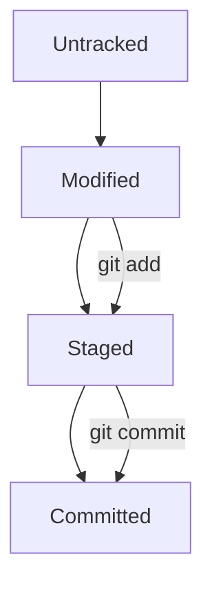

# Git Basics - Commands Guide

Git is a powerful version control system used for tracking changes in source code. Below are some of the most commonly used Git commands for beginners.

## 1. Git Configuration
Before starting to use Git, you need to configure your identity.

```bash
git config --global user.name "Your Name"
git config --global user.email "your.email@example.com"
```

## 2. Initializing a Repository
To start a new Git repository, navigate to your project directory and run:

```bash
git init
```

## 3. Cloning a Repository
To clone an existing repository from a remote server:

```bash
git clone https://github.com/username/repo.git
```

## 4. Checking the Repository Status
To see the status of your working directory:

```bash
git status
```

## 5. Staging Files
To add specific files to the staging area:

```bash
git add filename
```

To add all files in the current directory:

```bash
git add .
```

## 6. Committing Changes
To commit your changes with a descriptive message:

```bash
git commit -m "Your commit message"
```

## 7. Viewing Commit History
To view the commit history in the repository:

```bash
git log
```

## 8. Pushing Changes
To push your changes to the remote repository:

```bash
git push origin branch-name
```

## 9. Pulling Changes
To pull the latest changes from the remote repository:

```bash
git pull origin branch-name
```

## 10. Creating a Branch
To create a new branch:

```bash
git checkout -b new-branch-name
```

## 11. Merging Branches
To merge a branch into the current branch:

```bash
git merge branch-name
```

## 12. Resolving Merge Conflicts
If you encounter a merge conflict, Git will pause the merge process. Resolve conflicts, then mark them as resolved with:

```bash
git add filename
git commit
```

## 13. Deleting a Branch
To delete a local branch:

```bash
git branch -d branch-name
```

To force delete a branch:

```bash
git branch -D branch-name
```

## 14. Undoing Changes
To revert unstaged changes:

```bash
git checkout -- filename
```

To reset all changes in the working directory:

```bash
git reset --hard
```

## 15. Git Hash (SHA-1)
Every commit in Git is identified by a unique hash (also known as a commit ID). This is a SHA-1 hash function that produces a 40-character hexadecimal string. You can see the hash of your commits when you run:

```bash
git log
```

Example output:

```
commit a9f5d8f3e4f2b8578971ebf438d209de768f21d5 (HEAD -> master)
```

## 16. Git HEAD
`HEAD` is a pointer that points to the current branch or commit. By default, it points to the latest commit in the current branch. You can use `HEAD` to refer to the tip of the branch in various commands. For example:

```bash
git checkout HEAD^  # Move one commit back
git reset HEAD~2    # Move two commits back
```

## 17. Git Log Customization
To see a condensed log with only commit messages and hashes:

```bash
git log --oneline
```

You can also view logs with graphical representations:

```bash
git log --graph --oneline
```

## 18. File Statuses and the Lifecycle of Files
In Git, files can be in one of the following statuses:

1. **Untracked**: The file is new and not yet tracked by Git.
2. **Modified**: The file has changes but has not been added to the staging area.
3. **Staged**: The file has been added to the staging area with `git add` and is ready for commit.
4. **Committed**: The changes are saved in the Git history.

Here's a simplified representation of the file lifecycle:



## 19. Commit Message Best Practices
Clear and descriptive commit messages are crucial for project collaboration and history tracking. Follow these guidelines:

- Use the imperative mood: "Add", "Fix", "Update".
- Keep the subject line under 50 characters.
- Separate the subject from the body with a blank line.
- Provide additional details in the body if necessary, especially for complex changes.

Example:

```
Add new feature to enhance performance

- Optimized the data caching mechanism
- Refactored the database query for faster retrieval
```

---

By mastering these commands and concepts, you'll have a strong foundation for using Git effectively in your projects.
